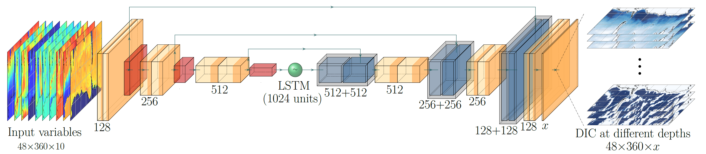

# Southern Ocean Carbon
This deep-learning (DL) U-net model applies the convolutional neural networks (CNN) and long short-term memory (LSTM) units to predict dissolved carbon dioxide profiles in the Southern Ocean using physical parameters that are readily available from satellite observations and climate reanalysis.

## 1. System prerequisites
The following software dependencies have been installed while testing and validating the model.

Package     | Version
---------   | -----------
Python      | 3.6.3
TensorFlow  | 2.1.0
CUDA        | 8.0.44
cuDNN       | 7.0
TensorFlow  | 2.1.0
Keras       | 2.3.1

The present demo (and the estimated install time and run time) below assumes that the users work with a Unix-like machine with a GPU. Estimated run time of training the demo model on a normal computer is also provided.

## 2. Download raw data
We propose a multi-phase training stratety to train the model. In phase 1, we use simulated diagnostics from the Biogeochemical Southern Ocean State Estimate (B-SOSE) data assimilation system. In phase 2, we train the model using observational datasets and climate reanalysis datasets. The input/output variables for both training phases are shown below:

### Table 2.1: Input variables
Input variable                                            | Phase 1 source      | Phase 2 source
----------------------------------------------------------|---------------------|--------------
Sea surface height anomaly (SSHA)                         | B-SOSE  ([Link](http://sose.ucsd.edu/BSOSE_iter105_solution.html))             | Copernicus Marine Service ([Link](https://resources.marine.copernicus.eu/?option=com_csw&view=details&product_id=SEALEVEL_GLO_PHY_L4_REP_OBSERVATIONS_008_047))
Flux of CO2 due to air-sea exchange (pCO2)                | B-SOSE              | Landschützer et al., 2016 ([Link](https://www.ncei.noaa.gov/access/ocean-carbon-data-system/oceans/SPCO2_1982_present_ETH_SOM_FFN.html))
Heat flux (Tflx)                                          | B-SOSE              | ERA5
Zonal component of ocean surface current velocity (U)     | B-SOSE              | OSCAR (Ocean Surface Current Analysis Real-time) ([Link](https://podaac.jpl.nasa.gov/dataset/OSCAR_L4_OC_third-deg))
Meridional component of ocean surface current velocity (V)| B-SOSE              | OSCAR (Ocean Surface Current Analysis Real-time)
Vertical component of ocean surface current velocity (W)  | B-SOSE              | Derived from SSHA
Surface Chlorophyll-a concentration (CHL-a)               | B-SOSE              | The GlobColour project ([Link](https://hermes.acri.fr/))
Zonal component of ocean surface wind speed (u10m)        | ERA5 ([Link](https://cds.climate.copernicus.eu/cdsapp#!/dataset/reanalysis-era5-single-levels?tab=overview))               | ERA5
Meridional component of ocean surface wind speed (v10m)   | ERA5                | ERA5
Sea surface temperature (SST)                             | ERA5                | ERA5

### Table 2.2: Output variables
Output variable                                         | Phase 1 source      | Phase 2 source
--------------------------------------------------------|---------------------|--------------
Dissolved inorganic carbon (DIC)                        | B-SOSE              | Global Ocean Data Analysis Project version 2 (GLODAPv2) shipboard measurements ([Link](https://www.ncei.noaa.gov/access/ocean-carbon-data-system/oceans/GLODAPv2/))<br />**and**<br />Southern Ocean Carbon and Climate Observations and Modeling (SOCCOM) biogeochemical Argo floats ([Link1](https://soccom.princeton.edu/) or [Link2](http://www3.mbari.org/SOCCOM/))


- Downloading the datasets could be done using the [`wget`](https://www.gnu.org/software/wget/manual/) package. 
- To download ERA5 data, a CDS account and a configuration file (.cdsapirc in your home directory) have to be set up. Instructions are documented [here](https://cds.climate.copernicus.eu/api-how-to#install-the-cds-api-key).
- It has to be stressed that the net download time could take ~1 week, depending on the download speed. A bash code to automate the downloading process could be helpful in reducing the time required.

## 3. Steps to process data before training

### 3.1) Regrid raw datasets using Climate Data Operators (CDO)
 - The raw datasets from B-SOSE (iter105), ERA5, GlobColour, and OSCAR have different resolutions. They have to be regridded to a 1° × 1° grid to be used by the DL model.
 - The datasets mentioned above are regridded to the 1° × 1° grid (grid file provided as `utils/SOCO2.grid`) using the nearest neighbor remapping function from the Climate Data Operators ([Link](https://code.mpimet.mpg.de/projects/cdo/embedded/index.html#x1-6600002.12.3)).
 - Example command: `cdo remapnn,utils/SOCO2.grid infile.nc outfile.nc`

### 3.2) Process datasets offline to NumPy readable format (.npy/.npz) 
 - The desired shape of input and output data arrays of the DL model is `(nsample, nlatitude, nlongitude, nvariable/ndepth)`. The regridded raw datasets have to be further processed to a NumPy readable format with the correct dimensions.
 - `nsample` could be any nonzero possitive integer. `nlatitude=48` and `nlongitude=360` to accommodate the 1° × 1° grid over the Southern Ocean. For the input data, `nvariable=10` for the 10 physical variables, whereas `ndepth=48` for the output data (DIC concentrations at 48 vertical levels).
 - The phase-1 training datasets (X and Y) are prepared using 3-day average fields from B-SOSE and hourly fields from ERA-5. This dataset covers from 1 Jan. 2008 to 31 Dec. 2012.
 - Psuedocode for phase-1 X and Y preparation:
 ```
 for each sample of the B-SOSE simulation:
 ├── read B-SOSE fields
 ├── convert unit of DIC to umol/kg
 ├── for every hour in the 3-day time window:
 │   ├── read and allocate ERA5 hourly fields
 ├── end for
 ├── calculate 3-day average ERA5 fields
 ├── concatenate B-SOSE and ERA5 fields along the `nvariable` dimension
 ├── write X and Y data to .npy or .npz
 end for
 ```
 - The scripts used to process the B-SOSE and ERA5 datasets are provided as the `example_data/scripts/data_prepare_iter105.py` file.
 - Example datasets used in the demo are stored in the `example_data/phase1_example_data/` folder.

### 3.3) Process in situ datasets offline
 - In situ datasets are used in the second training phase. They also have to be aggregated to the 1° × 1° grid to be used by the U-net.
 - The phase-2 input datasets (X) are prepared using physical variables from sources mentioned in Table 2.1.
 - The phase-2 output datasets (Y) are prepared by aggregating measurements from Argo/GLODAPv2. The Argo data covers from 2014 to 2019, whereas the GLODAPv2 data covers from 1993 to 2019.
 - Both X and Y datasets are 5-day average fields. For each year, there would be `n5day=73` samples.
 - Pseudocode for phase-2 X generation:
 ```
 for each year from 1993 to 2019:
 ├── for each 5-day time window of the year:
 │   ├── read the regridded data from phase-2 sources in Table 2.1.
 │   ├── for every hour in the 5-day time window:
 │   │   ├── read and allocate ERA5 hourly fields
 │   ├── end for
 │   ├── calculate 5-day average ERA5 fields
 │   ├── concatenate physical variables along the `nvariable` dimension
 │   end for
 end for
 ```
 - Pseudocode for phase-2 Y generation:
 ```
 for each year from 2014/1993 to 2019:
 ├── prepare a NumPy array with shape of (n5day, nlatitude, nlongitude, ndepth)
 ├── for each raw measurement file for this year:
 │   ├── read information about datetime, longitude, latitude, and measured DIC
 │   ├── for each measurement in this file:
 │   │   ├── find the indicies for the nearest grid cell for each measurement
 │   │   ├── find the index for the corresponding 5-day time window
 │   │   endfor
 │   end for
 ├── average measured DIC in each grid box
 end for
 ```
 - The script used for the phase-2 X data generation is the `example_data/scripts/X_prepare.py` file.
 - The scripts used for the phase-2 Y data generation are the `example_data/scripts/Argo_sampler.py` file and the `example_data/scripts/GLODAPv2_sampler.py` file.
 - Example datasets used in the demo are in the `example_data/phase2_example_data/` folder.

### 3.4) Estimated run time
- The net time required by this data preparation process can take 12~24 hours. A bash code to automate this process could be helpful in reducing the time required.

## 4. Getting started with training a demo model
### 4.1) Usage using a Jupyter Notebook
 - The example.ipynb jupyter notebook contains several examples about the usage of the U-net model. 
### 4.2) Usage using command lines
#### To train a U-net model:
```
python ./train_model.py --x sample_data/phase1_sample_data/X/X_* --y sample_data/phase1_sample_data/Y/Y_* --lvl1 1 --lvl2 2 --b 20 --o model_weights_example.h5
```
<!-- As an example, you can try to train a U-net model using the Argo floats measurements with:
```
python train_model.py --x example_data/Argo/train/*_predictors.npy --y example_data/Argo/train/*_DIC.npy --o Unet_model_Argo.h5
``` -->
 - Path for the prepared X datasets is specified after `--x`.
 - Path for the prepared X datasets is specified after `--y`.
 - Final model weights are saved in `.h5` format with a filename specified after `--o`.
 - `--lvl1` and `--lvl2` specify the initial and end vertical levels to be trained simultaneously to save computational time.
 - `--b` specifies the batch size, which is a tunable hyperparameter defining the number of samples to be trained simultaneously to save computational time.

#### To use a pretrained model to generate DIC predictions:
```
python ./model_predict.py --x sample_data/phase1_sample_data/X/X_* --lvl1 1 --lvl2 2 --w path/to/model/weights.h5 --o example_output
```
 - `--w` specifies the filename of the pretrained model weights.
 - Here `--o` specifies the path to save the U-net predictions.

### 4.3) Expected output
 - Training logs in `.csv` showing the evolution of the loss.
 - Model checkpoints in `.h5` format.
 - Final model weights in `.h5` format after the training is finished.

### 4.4) Estimated run time for training the demo model
 - On a normal computer with an i7-6700K CPU and without GPU functionality (with 2 vertical layers trained simultaneously and batch size to be 5): Each epoch takes ~16 seconds. It takes ~10 minute (30 ~ 50 epochs) for R-sqaured to reach 0.8. Training of the 48 layers would take ~3 hours.
 - On ComputeCanada's Graham cluster with the NVIDIA T4 Turing card (with 2 vertical layers trained simultaneously and batch size to be 5): Each epoch takes ~1 second. It takes ~1 minute for R-sqaured to reach 0.8. Training of the 48 layers would take ~1 hour.
 
### 4.5) Estimated run time with full data and misc
 - On ComputeCanada's Graham cluster with the NVIDIA T4 Turing card: training the U-net model on full datasets could take 1~2 weeks.
 - For the paper results, phase-1 training is stopped after the Squared Error Loss decreases to below 200. Phase-2 training is stopped after the Squared Error Loss decreases to below 20.

## References
1. Landschützer, P., Gruber, N., Bakker, D. C. E.: Decadal variations and trends of the global ocean carbon sink, Global Biogeochemical Cycles, 30, [doi:10.1002/2015GB005359](https://doi.org/10.1002/2015GB005359), 2016
2. Varvara E. Zemskova, et al.: A deep-learning estimate of the decadal trends in the Southern Ocean carbon storage, preprint, (https://doi.org/10.31223/X52603), 2021.
